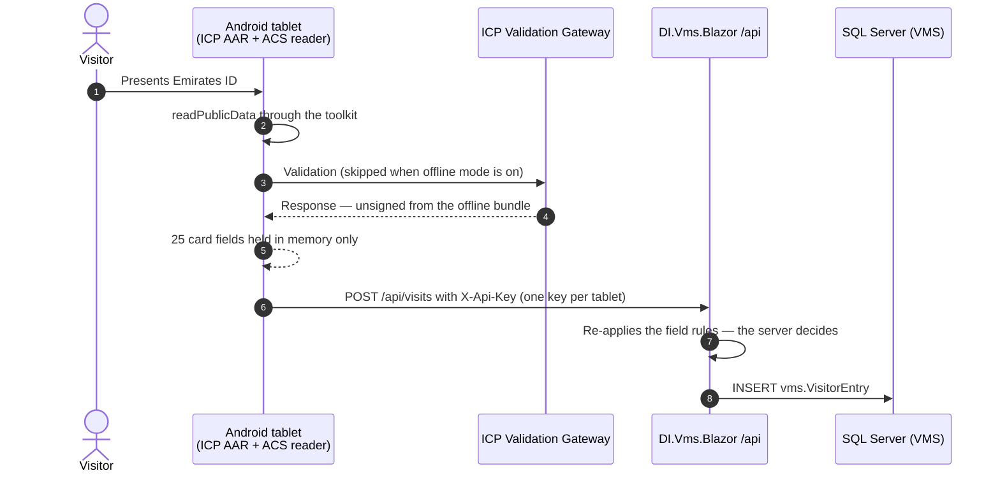
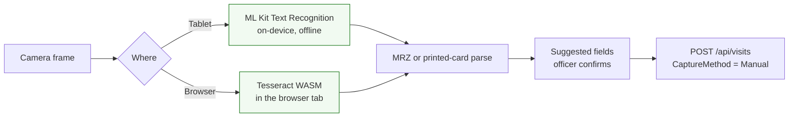
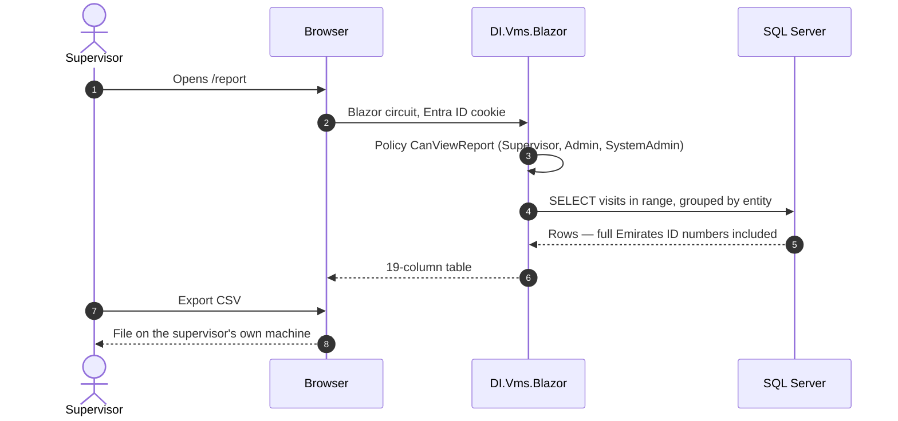

# Data Flow Diagram

**Visitor Management System · Dubai Investments PJSC**
DI-IT-POL-AIDEV-001 §6 — Data Flow Diagram (Controlled, required)

Personal data is what makes this application Controlled, so these diagrams trace the
personal data specifically: where it enters, what carries it, where it comes to rest, and
every point at which it crosses a trust boundary.

---

## 1. Check-in — reading the card at the desk

```mermaid
sequenceDiagram
    autonumber
    actor V as Visitor
    participant R as PC/SC reader<br/>(reception PC)
    participant A as ICP desk agent<br/>(Windows service)
    participant B as Desk browser
    participant S as DI.Vms.Blazor
    participant ICP as ICP Validation Gateway
    participant DB as SQL Server (VMS)

    V->>R: Presents Emirates ID, chip first
    B->>A: readPublicData over wss://localhost
    A->>R: APDU exchange with the chip
    R-->>A: Public data (name, ID number, photo, address)
    A->>ICP: Validate against Service Provider licence
    ICP-->>A: Signed response
    A-->>B: Signed XML
    B->>S: Relays signed XML over the Blazor circuit
    S->>S: Verifies the signature
    S-->>B: Fields shown for the officer to confirm
    B->>S: Officer adds host, purpose, mobile; saves
    S->>DB: INSERT vms.VisitorEntry (+ VisitorCardImage)
```

**Trust boundaries crossed:** reception PC → ICP (over the internet, step 5); desk browser
→ server (step 8); server → database (step 12).

**What is in flight:** the cardholder's full identity — name in English and Arabic,
Emirates ID number, card number, date of birth, nationality, gender, place of birth, the
chip's home-address block, and a JPEG photograph.

## 2. Check-in — the tablet



**The tablet keeps nothing.** Card fields live in the view model for the length of one
check-in and are gone when the screen resets. Nothing is written to the tablet's storage
except the server address, the API key and the settings PIN hash.

**The tablet's read is not signed.** The server stores what the tablet sends without being
able to prove the chip produced it. Recorded as risk R-01.

## 3. Camera fallback — nothing leaves the device



No image is uploaded, no OCR service is called, and no frame is retained. The visit is
recorded as `Manual` — the desk saw the card, the system did not.

## 4. Reading the report



**This is the weakest point in the whole flow and it is deliberate that it says so.** The
report shows Emirates ID numbers in full, the CSV leaves the system entirely, and **nothing
records that either happened**. See risks R-03 and R-04.

## 5. Where personal data comes to rest

| Store | What | Encrypted | Retention |
|---|---|---|---|
| `vms.VisitorEntry` | 40 columns of visitor identity and visit detail | At rest by SQL Server TDE where enabled on the instance; **not** at column level | **Nothing deletes a visit.** No retention job exists. |
| `vms.VisitorCardImage` | The rendered card image, one row per visit at most | As above | Cascade-deleted with the visit; nothing deletes the visit |
| Azure Blob Storage | The same card images, where a storage account is configured | Microsoft-managed keys | As above |
| `vms.Person` | Staff directory export — display name, title, email, company | As above | Maintained by script in `db/` |
| Android tablet | Server address, API key, PIN hash (PBKDF2-HMAC-SHA256). **No visitor data.** | Android app-private storage | Cleared with the app's data |
| Supervisor's machine | Exported CSV | Whatever that machine does | Outside this system |

## 6. Data leaving the organisation

Exactly one outbound flow, and it is to the government body that issues the card:

| To | What | When | Controlled by |
|---|---|---|---|
| ICP Validation Gateway | The card validation request, against the Service Provider licence | On every chip read, unless offline mode is on | ICP's own licence terms |

There are **no** other third-party calls. No analytics, no telemetry, no OCR service, no
AI inference endpoint. The Tesseract engine and its trained data are fetched from a CDN by
the browser; those requests carry no card data.

## 7. Trust boundaries, summarised

| # | Boundary | Crossed by | Protected by |
|---|---|---|---|
| TB-1 | Visitor → reader | Physical card | The visitor hands it over |
| TB-2 | Reception PC → ICP | Validation request | TLS, ICP Service Provider licence |
| TB-3 | Desk browser → server | Signed card XML, form fields | HTTPS, Entra ID cookie (HttpOnly, Secure, SameSite=Strict), signature verification server-side |
| TB-4 | Tablet → server | Card fields, form fields | HTTPS, `X-Api-Key` per tablet, rate limit 300/min/IP, server re-applies all field rules |
| TB-5 | Server → database | Everything | Connection string held in Azure app settings or `appsettings.Production.json` (gitignored), never in a committed file |
| TB-6 | Server → Blob Storage | Card images | Account key, same handling as above |
| TB-7 | Server → supervisor's machine | CSV export | **Entra ID role only. Not logged.** ← R-04 |
